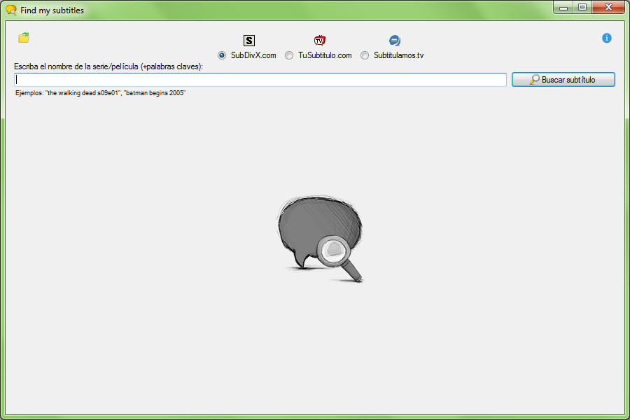
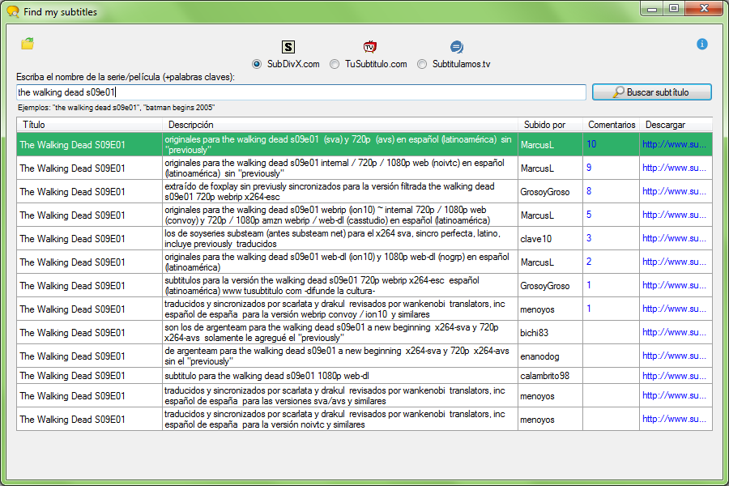
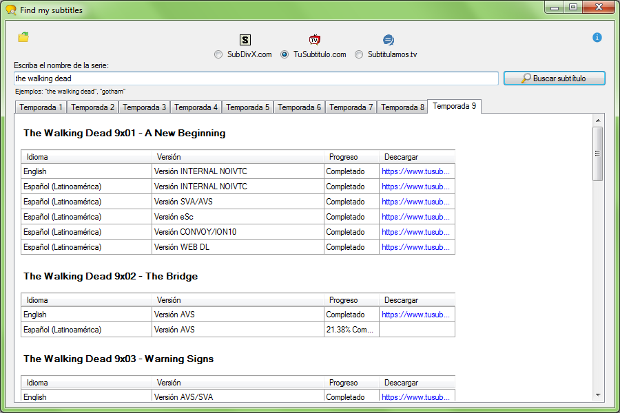
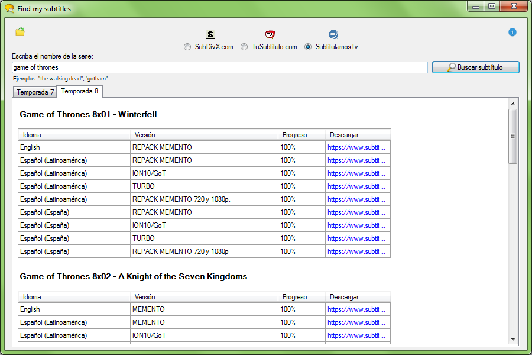
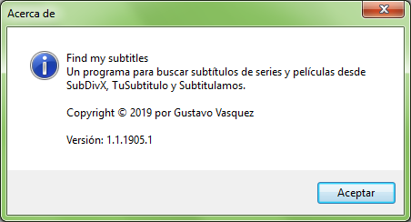

# Proyecto_SubtitleFinder
Aplicación winforms para buscar subtítulos de series y películas usando como fuente sitios web utilizando web scraping.

Ventana principal
:-------------------------:

Con el programa podrás buscar subtítulos en cualquiera de las tres fuentes disponibles (Subdivx, TuSubtitulo, Subtitulamos).
Una vez que se descarga el archivo de subtítulo, desde el icono de carpeta se puede abrir el explorador de Windows directamente en la carpeta de descargas.

Búsqueda por Subdivx
:-------------------------:

Búsqueda por TuSubtitulo
:-------------------------:

Búsqueda por Subtitulamos
:-------------------------:

Información del programa
:-------------------------:

Al buscar, el programa hará uso de web scraping y recopilará toda la información necesaria desde la página de resultados del sitio web.
Según la fuente elegida para buscar subtítulos, los resultados aparecerán de forma diferente.

## Notas
Este programa fue hecho usando ASP.NET Winforms C#

## Autor
Gustavo Vasquez
